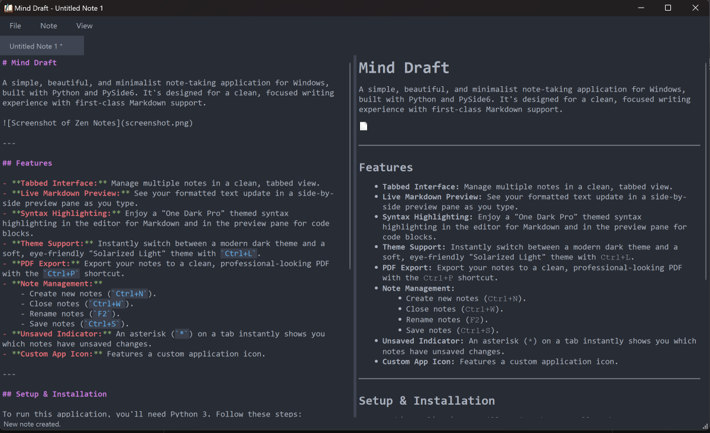

# Mind Draft

A simple, beautiful, and minimalist note-taking application for Windows, built with Python and PySide6. It's designed for a clean, focused writing experience with first-class Markdown support.



---

## Features

- **Tabbed Interface:** Manage multiple notes in a clean, tabbed view.
- **Live Markdown Preview:** See your formatted text update in a side-by-side preview pane as you type.
- **Syntax Highlighting:** Enjoy a "One Dark Pro" themed syntax highlighting in the editor for Markdown and in the preview pane for code blocks.
- **Theme Support:** Instantly switch between a modern dark theme and a soft, eye-friendly "Solarized Light" theme with `Ctrl+L`.
- **PDF Export:** Export your notes to a clean, professional-looking PDF with the `Ctrl+P` shortcut.
- **Note Management:**
    - Create new notes (`Ctrl+N`).
    - Close notes (`Ctrl+W`).
    - Rename notes (`F2`).
    - Save notes (`Ctrl+S`).
- **Unsaved Indicator:** An asterisk (`*`) on a tab instantly shows you which notes have unsaved changes.
- **Custom App Icon:** Features a custom application icon.

---

## Setup & Installation

To run this application, you'll need Python 3. Follow these steps:

1.  **Create a Virtual Environment:**
    ```bash
    python -m venv venv
    ```

2.  **Activate the Environment (on Windows):**
    ```bash
    .\venv\Scripts\activate
    ```

3.  **Install Dependencies:**
    ```bash
    pip install PySide6 markdown2 Pygments
    ```

---

## How to Run

With your virtual environment activated, simply run the main Python script:

```bash
python main.py
```